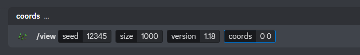
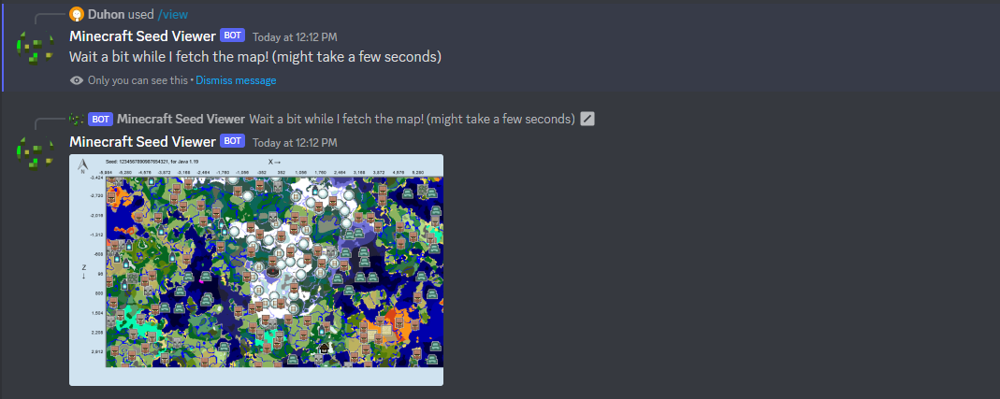
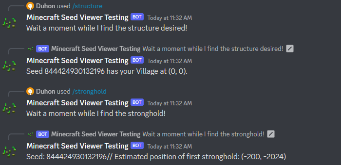

# Minecraft-Seed-Viewer-Bot

# Examples

This is an example command on the bot. After a few moments, it'll fetch the rendered version of this seed.

It also finds you a seed with a specific structure at spawn, structure's on set seeds, and that seed's estimated stronghold location.

# Setup

If you want to run this bot yourself, great! Please start by downloading the latest version of Python and then discord.py:

`pip install discord.py`

Then go to https://github.com/hube12/Minemap and download the latest release (specifically the .jar) and then rename it to just **MineMap.jar**. Place it in the same folder as **bot.py**.

**If not running on Windows, do the following:**
Go to the "cubiomes files" folder inside of "release" and then follow the compilation instructions text file, since I compiled my .out's in a Windows machine they do NOT work on Linux or Mac. Make SURE to name the find_structure output a.out, the stronghold b.out, the biome (without structure) to c.out, the biome with structure d.out and the new_search.c e.out. 

# Contribute

Well, feel free to! If you have any questions, here's my socials so you can get in touch:

Discord: Duhon#1833

Discord Support Server: https://discord.gg/ZBpgKVxVTR

# Thanks to

https://github.com/hube12/Minemap

For the rendering functions, mostly since they have a cmd screenshot function.

https://github.com/Cubitect/cubiomes

For the c library needed for the seed finders.
